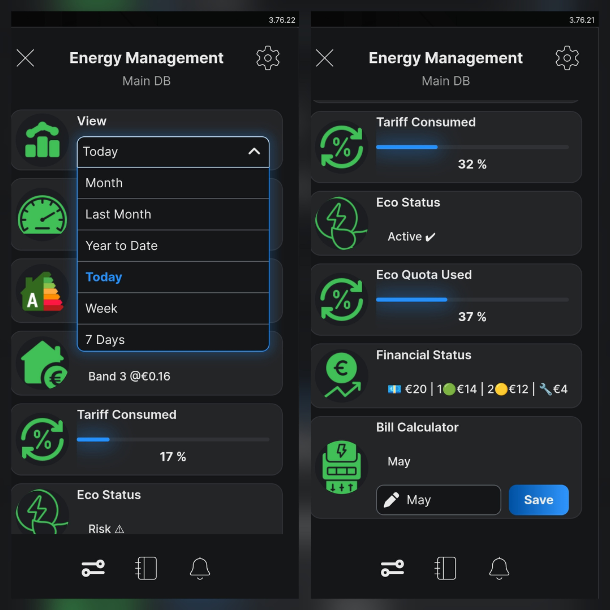
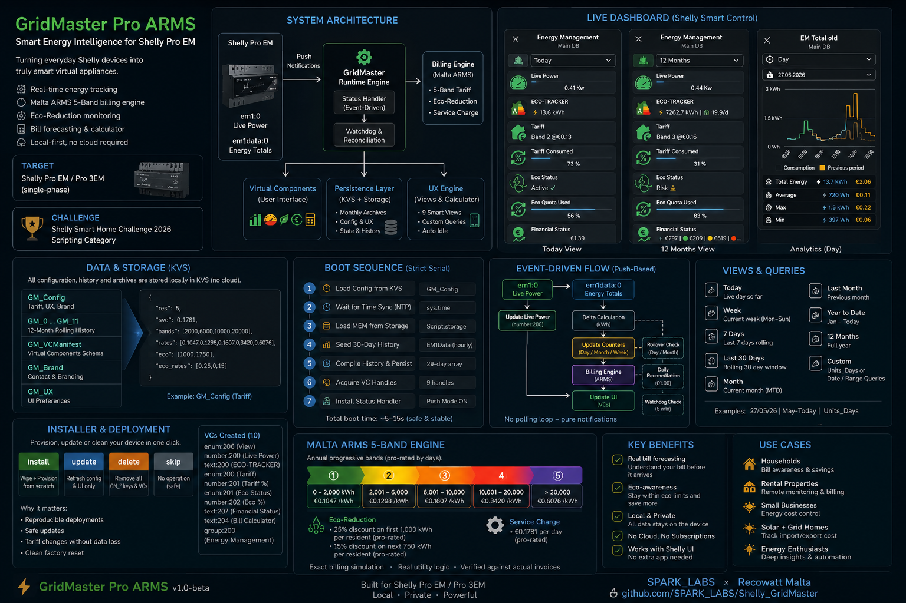
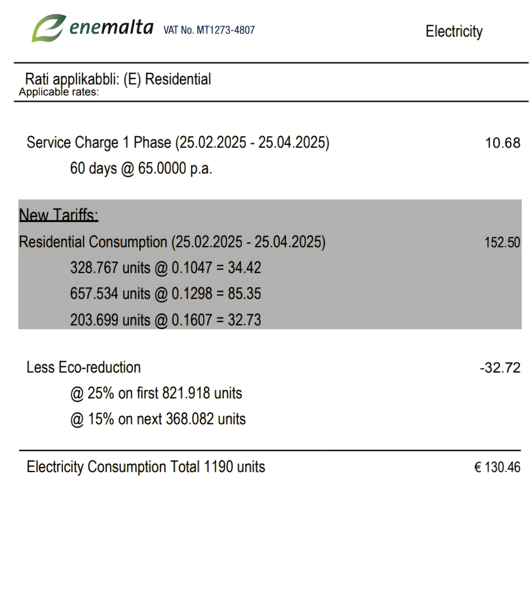
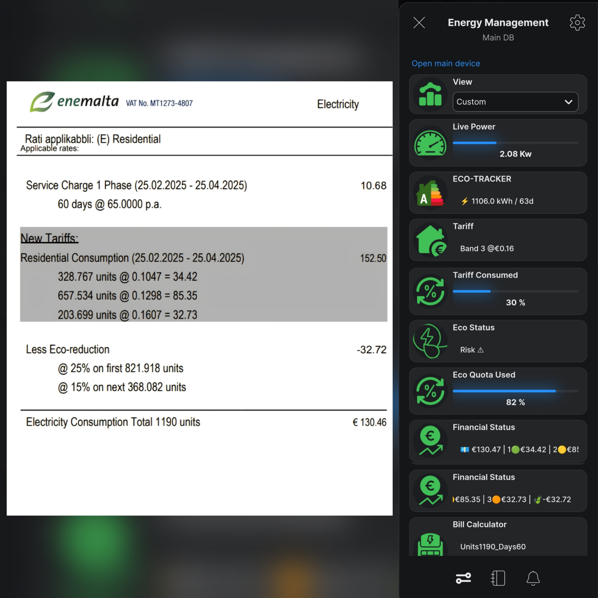
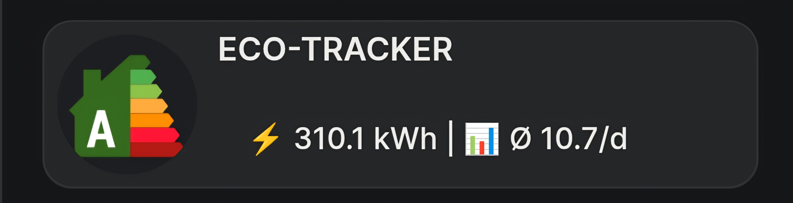
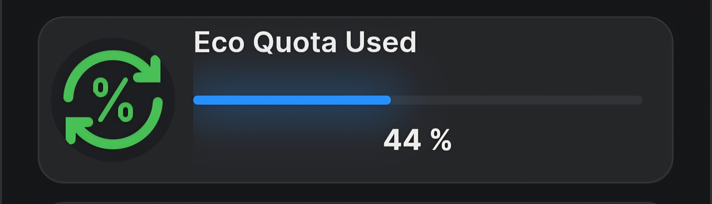

# ⚡ GridMaster Pro ARMS

### *A Progressive Band Tariff Billing Engine for Shelly Pro EM with real utility-grade billing intelligence — running fully on-device*

**GridMaster Pro ARMS** turns an everyday Shelly energy monitor into a self-contained billing engine. Written natively in mJS, it implements Malta's progressive **ARMS 5-band electricity tariff** — pro-rated bands, resident-scaled eco reductions, and daily service charges — directly on the meter, with zero cloud dependency and no companion server. The device computes its own bill and projects the result onto its native Shelly UI.



Built by **SPARK_LABS**.

---

## 📋 Table of Contents

1. [The Challenge & The Solution](#-the-challenge--the-solution)
2. [Hardware Compatibility](#-hardware-compatibility)
3. [System Architecture](#%EF%B8%8F-system-architecture)
4. [Mathematical Engine Validation (Real Bill Comparison)](#-mathematical-engine-validation-real-bill-comparison)
5. [Virtual Dashboard UI Components](#-virtual-dashboard-ui-components)
6. [Quick Start (Installer)](#-quick-start-installer)
7. [Known Limitations](#-known-limitations)
8. [Repository Structure](#-repository-structure)
9. [License & Attribution](#-license--attribution)

---

## 🎯 The Challenge & The Solution

Calculating electricity cost under the Malta ARMS model is notoriously awkward. The utility stacks **5 progressive consumption bands** on top of **resident-based eco-reductions** and a fixed daily service charge, with every annual threshold pro-rated dynamically by the exact number of days elapsed in the year.

Standard smart meters only report raw cumulative kWh. You have no idea which pricing band you are in, how close you are to the next one, or what your bill will be until it arrives.

```
         Progressive 5-Band Tariff Structure (Annual)
         ━━━━━━━━━━━━━━━━━━━━━━━━━━━━━━━━━━━━━━━━━━━━

  Band 1 │🟢██████████│  0 – 2,000 kWh      @ €0.1047/kWh
  Band 2 │🟡██████████│  2,001 – 6,000 kWh   @ €0.1298/kWh   (+24%)
  Band 3 │🟠██████████│  6,001 – 10,000 kWh  @ €0.1607/kWh   (+53%)
  Band 4 │🔴██████████│  10,001 – 20,000 kWh @ €0.3420/kWh   (+227%)
  Band 5 │⛔██████████│  > 20,000 kWh        @ €0.6076/kWh   (+480%)

         Every threshold is pro-rated daily — your band boundaries
         shift with each day of the year. GridMaster tracks this
         in real time, on-device, with no cloud.
```

A household crossing from Band 2 into Band 3 sees a **24% price jump per unit** — and from Band 3 into Band 4 it more than doubles. Standard energy monitors give zero warning. **GridMaster Pro ARMS** closes that gap by running an embedded, real-time billing engine on the meter itself. It subscribes to the hardware's energy telemetry, maintains a rolling 30-day history, and renders an accurate financial statement onto the native Shelly app — no external servers, no cloud round-trips, no cross-device dependency.

---

## 🔌 Hardware Compatibility

The engine reads from the Shelly **`em1` / `em1data`** component family. Any meter that exposes those components will run the same code; porting between models is a single adjustment — set the component **instance id** to the channel your grid CT is clamped on.

| Device | Profile | Grid channel id |
| --- | --- | --- |
| Shelly Pro EM | single-phase (native) | `0` (channel A) or `1` (channel B) |
| Shelly EM Gen3 / EM Gen4 / EM Mini Gen4 | single-phase (native) | `0` |
| Shelly Pro 3EM / 3EM Gen3 / 3EM Gen4 | **monophase** profile | `0`, `1`, or `2` |

Verify the channel before deploying:

```javascript
Shelly.getComponentStatus("em1", 0); // returns the live em1:0 reading
```

The brain references the component at four points in `GridMaster_Pro.js` (lines 227, 261, 271, 333). To target a different channel, set the id / component string consistently across all four.

> **Note on three-phase mode:** A 3EM left in its default **triphase** profile exposes the `em` / `emdata` component instead of `em1` — see [Known Limitations](#-known-limitations).

---

## 🖥️ System Architecture

The runtime uses a strict serial boot sequence and a decoupled, event-driven execution layer to stay stable on embedded hardware.

### System Diagram & Execution Flow



### Strict-Serial Boot Pipeline

Boot is a deterministic 7-stage chain — each stage completes (and its async callback returns) before the next is scheduled, so the engine never races its own initialisation on a cold start.

1. **KVS configuration load** — reads the tariff blob from `GM_Tariff`; falls back to hardcoded ARMS defaults if the key is absent or fails to parse.
2. **NTP synchronisation** — waits for the hardware clock to sync, then captures the UTC offset once for the session.
3. **Persistent memory recovery** — restores month/day totals and the 30-day history array from KVS, or flags that seeding is required.
4. **30-day seeding lookback** — if memory is empty, rebuilds the rolling window from the meter's own historical interval records.
5. **Historical database compile** — assembles the in-memory history array, recalculates the week window, and force-saves a clean baseline.
6. **Virtual UI binding** — acquires all 9 virtual-component handles via `Virtual.getHandle()`; warns per-handle if any are unassigned (a signal to run the installer first).
7. **Push telemetry mount** — stamps the meter baseline, attaches the `handle.on('change', …)` view/calculator listeners and the `em1data` status subscription, arms the watchdog timer, and renders the first view.

Representative cold-boot trace:

```
🚀 [BOOT] GridMaster Pro ARMS v1.3 [Production Locked]
📥 [1/7] Loading configuration from KVS storage matrix...
   ↳ GM_Tariff loaded successfully (5 residents, 5 bands)
📅 [2/7] Hardware NTP clock synchronized
   ↳ System Timezone Offset verified: 1h
💾 [3/7] Accessing persistent memory sector...
   ↳ MEM state recovered safely
🌱 [4/7] Initiating 30-day sequential seeding lookback from hardware logs...
📊 [5/7] Compiling parsed historical database elements...
   ↳ Seeding complete — storage intervals mapped
   📊 [HEAP TELEMETRY] Post-Seeding Execution | Available Memory Buffer: <free> bytes
🎯 [6/7] Interfacing with Virtual UI Component bindings...
   ↳ All 9 programmatic control handles linked.
✅ [7/7] Mount-loading asynchronous push telemetry routines...
   ↳ Meter Index Base Stamp recorded
⚡ GRIDMASTER CORE PLATFORM ONLINE // EMBEDDED MIDDLEWARE EXECUTING
```

### Push Telemetry

There is no polling loop for energy data. Calculations fire only when the meter reports a new `total_act_energy` value via its status subscription. A watchdog timer falls back to a single manual poll if no push arrives within its interval, so a missed notification can never silently freeze the totals.

### Flash Endurance Guard

Writes to non-volatile storage are throttled to protect the flash from premature wear. State is hardened only when a cumulative delta of **0.5 kWh** is reached, when **15 minutes** have elapsed, or when a force flag is raised (boot, daily rollover, monthly archive). Routine telemetry updates stay in RAM.

### Heap Monitoring

Free RAM (`sys.ram_free`) is logged at key lifecycle points — after seeding and once the platform is online — and a low-memory warning is raised below **25,000 bytes**, giving early visibility of heap pressure on the shared script engine.

---

## 🧮 Mathematical Engine Validation (Real Bill Comparison)

To prove the accuracy of the mJS calculation engine, its internal mathematics are compared directly against a real Enemalta invoice.

### Enemalta Historical Utility Invoice



---

### Invoice Baseline Data

* **Days in billing cycle ($d$):** $60 \text{ days}$
* **Yearly ratio ($r$):** $\frac{60}{365} \approx 0.16438356$
* **Household residents:** $5$
* **Active consumption ($u$):** $1190 \text{ kWh}$
* **Fixed service charge rate:** $\text{€}0.1781 \text{ per day}$ ($\text{€}65.00 \text{ p.a.}$)

---

### 💶 Service Charge

$$
\text{Service Charge} = d \times 0.1781 = 60 \times 0.1781 = \text{€}10.686 \approx \text{€}10.68
$$

> 📅 60 days × 💶 €0.1781/day = **€10.68** service charge ✅

*Matches the invoice line item exactly.*

---

### 📊 Progressive Band Calculations

Annual thresholds for Malta's 5-band residential tariff, pro-rated for $60 \text{ days}$ by the yearly ratio $r$:

* **Band 1 limit:** $2000 \text{ kWh} \times r = 328.767 \text{ units}$
* **Band 2 limit:** $6000 \text{ kWh} \times r = 986.301 \text{ units}$ (span $657.534$)
* **Band 3 limit:** $10000 \text{ kWh} \times r = 1643.836 \text{ units}$ (span $657.534$)

The $1190 \text{ units}$ consumed distribute across the pro-rated bands:

$$
\begin{aligned}
\text{Band 1} &= 328.767 \times \text{€}0.1047 = \text{€}34.42 \\
\text{Band 2} &= 657.534 \times \text{€}0.1298 = \text{€}85.35 \\
\text{Band 3} &= (1190 - 328.767 - 657.534) \times \text{€}0.1607 \\
&= 203.699 \times \text{€}0.1607 = \text{€}32.73
\end{aligned}
$$

> 🟢 328.8 units × €0.1047 = **€34.42** Band 1
> 🟡 657.5 units × €0.1298 = **€85.35** Band 2
> 🟠 203.7 units × €0.1607 = **€32.73** Band 3
> ➕ Total energy charge = **€152.50** ✅

*These allocations match the invoice lines exactly.*

---

### 🌿 Eco-Reduction Discount

A property with 5 registered residents qualifies for eco-reductions, calculated from pro-rated annual allowances ($1000 \text{ kWh}$ and $1750 \text{ kWh}$):

* **Eco base limit ($eb$):** $1000 \times 5 \times r = 821.918 \text{ units}$
* **Eco upper limit ($el$):** $1750 \times 5 \times r = 1438.356 \text{ units}$

Total consumption ($1190$) sits below the upper limit, so the discount is active:

1. **Base portion (25%)** — first $821.918 \text{ units}$ (all of Band 1, plus the first $493.151$ of Band 2):

$$
\begin{aligned}
cb2 &= \text{€}34.421 + (493.151 \times \text{€}0.1298) = \text{€}98.432 \\
\text{Discount}_{base} &= \text{€}98.432 \times 0.25 = \text{€}24.608
\end{aligned}
$$

2. **Upper portion (15%)** — units between the base limit and total ($1190 - 821.918 = 368.082$):

$$
\begin{aligned}
cu2 &= (164.383 \times \text{€}0.1298) + \text{€}32.734 = \text{€}54.071 \\
\text{Discount}_{upper} &= \text{€}54.071 \times 0.15 = \text{€}8.111
\end{aligned}
$$

3. **Total discount:**

$$
\text{Eco-Reduction} = \text{€}24.608 + \text{€}8.111 = \text{€}32.719 \approx \text{€}32.72
$$

> 🌿 First 821.9 units → 25% discount = **−€24.61**
> 🌱 Next 368.1 units → 15% discount = **−€8.11**
> 💰 Total eco-reduction = **−€32.72** ✅

---

### 🧾 Final Bill

$$
\text{Final Cost} = \text{€}152.50 + \text{€}10.68 - \text{€}32.72 = \text{€}130.46
$$

> 📊 Energy: €152.50 + 💶 Service: €10.68 − 🌿 Eco: €32.72 = **€130.46** ✅



*The mJS engine reproduces the physical Enemalta invoice to the cent.*

---

## 📊 Virtual Dashboard UI Components

The application instantiates and updates **9 interconnected virtual components** under a single control board:

| UI Component | Type | Function |
| --- | --- | --- |
| **View**  | Dropdown | Cycles time windows: Today, Week, Month, Last 30 Days, Year to Date, Custom. |
| **Live Power**  | Progress bar | Real-time active load in kW. |
| **Eco-Tracker**  | Label | Energy consumed in the selected window, plus a daily-average indicator. |
| **Tariff**  | Label | Active price band (e.g. `Band 3 @ €0.16`). |
| **Tariff Consumed**  | Progress bar | Percentage of the current pro-rated band allocation used. |
| **Eco Status**  | Label | Efficiency state: **Active ✔**, **Risk ⚠**, or **VOID ❌**. |
| **Eco Quota Used**  | Progress bar | Progress toward the annual eco allocation caps. |
| **Financial Status**  | Label | Full cost breakdown — tiers, service charge, discount. |
| **Bill Calculator**  | Input field | Interactive terminal for raw consumption queries. |

### Bill Calculator Usage

Write to the calculator field in `kWh_days` format — e.g. `350_30` calculates the cost of $350 \text{ kWh}$ consumed over $30 \text{ days}$, pro-rated on-device.

---

## 🛠️ Quick Start (Installer)

Deployment is split into an installer and a runtime engine to keep the engine's callback chains shallow on embedded mJS.

1. **Confirm your grid channel.** Run `Shelly.getComponentStatus("em1", 0)` in the device console and check the live reading reflects your grid CT. If your CT is on a different channel, note the id and see [Hardware Compatibility](#-hardware-compatibility).
2. **Deploy the installer.** Save `GridMaster_Pro_Setup.js` to the device, set your household profile in *Section 2* (residents, service-charge baseline), and run it. It provisions the 9 virtual components and seeds the default ARMS tariff into KVS.
3. **Verify provisioning.** Watch the console diagnostics until the `✅ COMPLETE` validation stamp appears.
4. **Deploy the engine.** Disable the installer, paste `GridMaster_Pro.js` into a new script, enable it, and watch the dashboard populate in real time.

---

## ⚠️ Known Limitations

Documented in the interest of honest engineering — none are submission blockers, all are bounded.

* **Three-phase profile mismatch.** The engine binds to the `em1` component. A 3EM running in its **default triphase profile** exposes `em` / `emdata` instead, so the push handler's exact-match subscription never fires — the dashboard renders normally but never updates, with no error raised. Switch the device to **monophase** profile, or remap the four `em1` references. Verify with `Shelly.getComponentStatus("em1", N)`.
* **Timezone bucketing inconsistency.** `queryDay()` uses Malta-aligned timestamps, while seed bucketing and rollover use raw UTC. This can produce a minor discrepancy between the Custom-day view and the Today / 7-day / 30-day views.
* **Warm-restart Today gap.** A mid-day reboot trusts the persisted day total, which is only as fresh as the last flash-save (up to 15 minutes stale). Low-visibility edge case.
* **DST changeover.** The UTC offset is captured once at boot. A manual script restart is required after a clock change.

---

## 📂 Repository Structure

```
Shelly_GridMaster/
├── GridMaster_Pro.js               # Production runtime engine (brain)
├── GridMaster_Pro_Setup.js         # Provisioning / installer utility
├── README.md
└── assets/
    ├── GM_UI.jpg                   # Hero — GridMaster Pro ARMS dashboard
    ├── GM_OVERVIEW.png             # System architecture & boot-logic diagram
    ├── GM_BILL_EXAMPLE.jpg         # Enemalta invoice validation reference
    ├── GM_CUSTOM.jpg               # Bill calculator validation screenshot
    ├── GM_VC_VIEW.jpg              # VC — view selector
    ├── GM_VC_LIVE.jpg              # VC — live power
    ├── GM_VC_TRACKER.jpg           # VC — eco-tracker (energy + daily average)
    ├── GM_VC_TARIFF.jpg            # VC — active band
    ├── GM_VC_TARIFF_CONSUMED.jpg   # VC — band allocation used
    ├── GM_VC_ECO_STATUS.jpg        # VC — eco status
    ├── GM_VC_ECO_CONSUMED.jpg      # VC — eco quota used
    ├── GM_VC_FINANCIAL.jpg         # VC — financial breakdown
    └── GM_VC_CALC.jpg              # VC — bill calculator
```

---

## ⚖️ License & Attribution

Developed by **⚡ SPARK_LABS**.

### Acknowledgements

* **[Shelly](https://www.shelly.com/)** — for the hardware platform, the mJS scripting engine, and the virtual-component framework that makes on-device UI possible.
* **[Shelly Academy](https://academy.shelly.com/)** — for the scripting courses and API walkthroughs that informed the patterns used across all SPARK_LABS projects.
* **Icons** — UI component icons sourced from [Icons8](https://icons8.com) (`https://img.icons8.com`).

---

**⚡ SPARK_LABS** — **S**helly **P**owered **A**utomation **R**eliable **K**ontrol

Technician, Installer & Shelly Academy Graduate at [Recowatt Malta](https://recowatt.com)

[github.com/Nc-eW22](https://github.com/Nc-eW22)

*Turning everyday Shelly devices into truly smart virtual appliances.*
